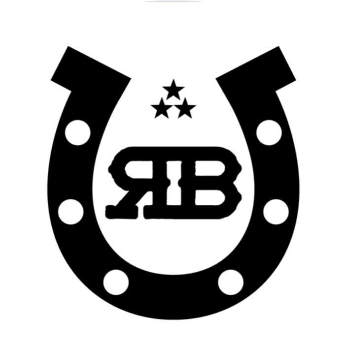

# The Ranch Barber App

An Android and iOS app to give clients easier access to a barbershop's appointment system and contact information.

## Project Details

- Developed using Flutter for cross-platform compatibility.
- Written in Dart.
- Makes use of WebView to fetch the barbershop's website and display it on mobile device.
- URLs to other parts of the barbershop's website open in the WebView. All other URLs open external apps depending on their URL scheme. Website schemes open in external browser, phone number schemes open in phone app, email schemes open in email app.

## Packages Used

- cupertino_icons
- flutter_launcher_icons
- flutter_lints
- flutter_test
- path_provider
- url_launcher
- webview_flutter
- connectivity_plus
